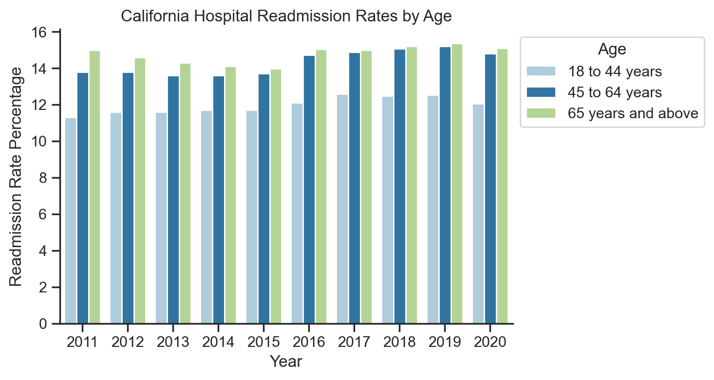
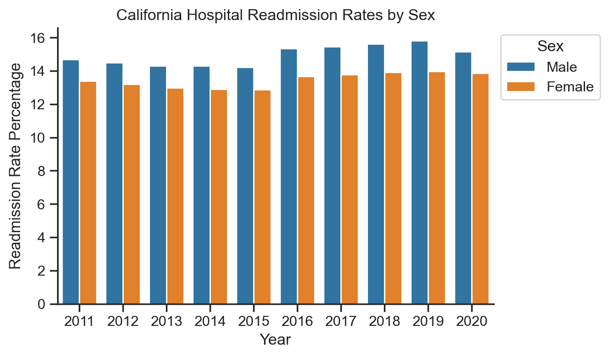
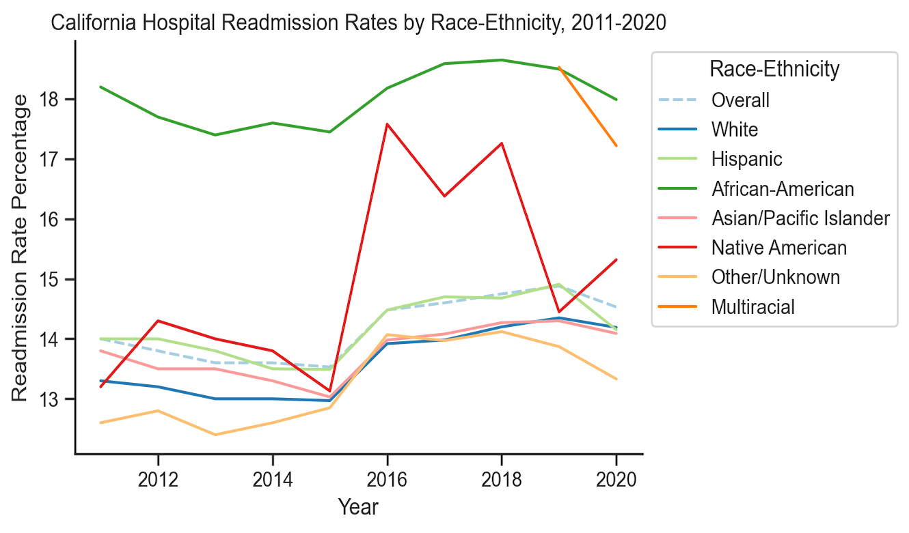
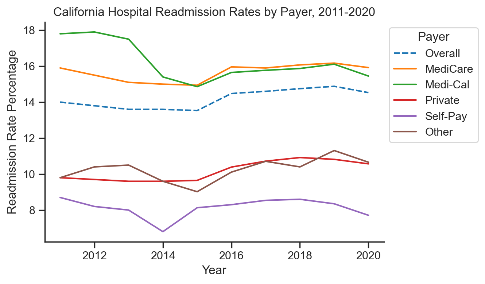
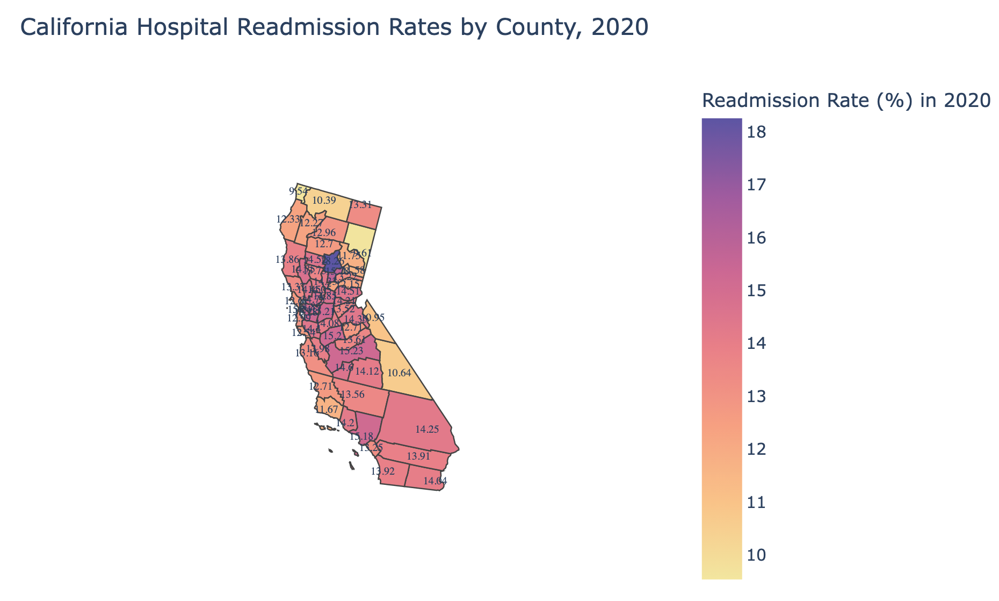
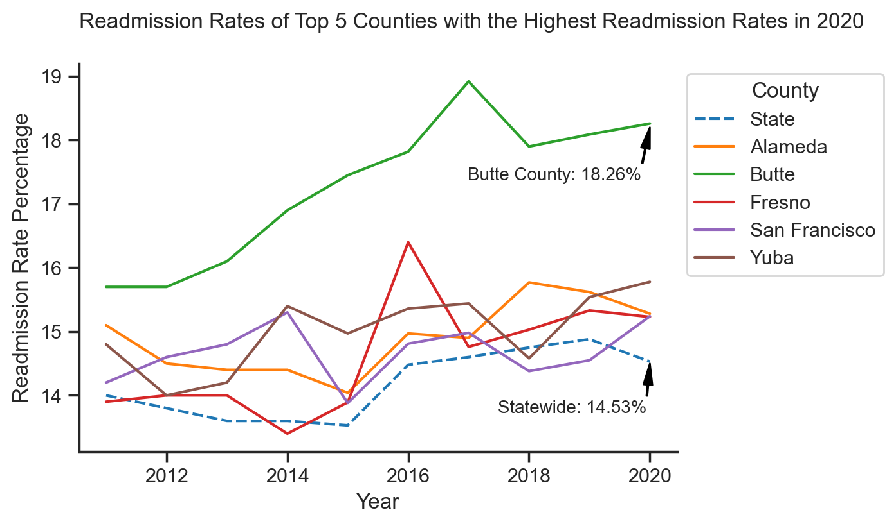
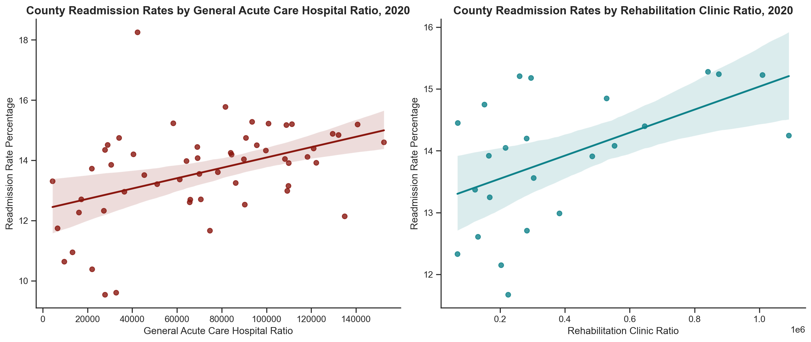
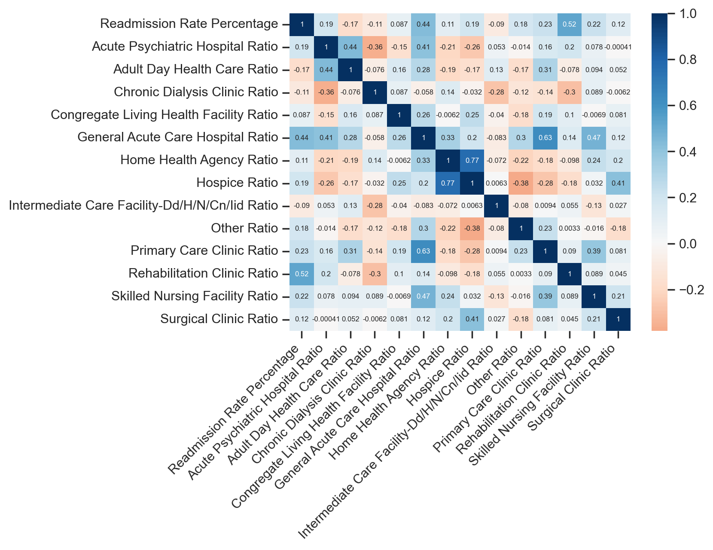

# Analysis of California 30-Day Inpatient Readmission Rates, 2011-2020
## Objective
This is a project to analyze all-cause unplanned 30-day hospital readmission rates of California statewide and counties, for years 1999-2008.

## Hypothesis
Age of patients, race/ethnicity of patients, payer type, county, population to LTC (Long Term Care) type facility ratio, and population to FDR (First Tier, Downstream, and Related Entities defined by CMS) type facility ratio are associated with hospital readmission.

## Language and Tools
- Language: Python
- Libraries: Pandas, Numpy, Matplotlib, Seaborn, Plotly, Requests, Json, Scipy
- Tools: AWS S3, AWS SageMaker

## Step 1 Obtaining the Data
I uploaded below data files to AWS S3 for online analyzing. The data files are from 1 main dataset and 2 subdatasets:

[**California All-Cause Unplanned 30-Day Inpatient Readmission Rates**](https://data.chhs.ca.gov/dataset/all-cause-unplanned-30-day-hospital-readmission-rate-california): It's the main dataset, which contains the statewide number and (unadjusted) rate for all-cause, unplanned, 30-day inpatient readmissions in California hospitals from 2011 to 2020 (contains first three quarters for Year 2015). Data are categorized by age, sex, race/ethnicity, expected payer and county.

[**California Licensed and Certified Healthcare Facility Listing**](https://data.chhs.ca.gov/dataset/healthcare-facility-locations): This dataset was recently updated in December, 2022. It includes California healthcare facilities that are operational and have a current license issued by the California Department of Public Health (CDPH) and/or a current U.S. Department of Health and Human Services’ Centers for Medicare and Medicaid Services (CMS) certification.

[**California County Population 2020-2021**](https://www.census.gov/data/tables/time-series/demo/popest/2020s-counties-detail.html): This dataset includes county population of California in 2020-2021.

## Step 2 Data Cleaning and Manipulation
I checked data from unknown counties, removed outliers, cleaned each dataset and merged them into one dataframe by the shared column `County`.

## Step 3 Analyze
I analyzed the readmission rate by Age, Sex, Race-Ethinicity, Payer, and County. Here are the corresponding charts:

  
&nbsp; &nbsp; &nbsp; &nbsp;
  

  
&nbsp; &nbsp; &nbsp; &nbsp;
  

  
&nbsp; &nbsp; &nbsp; &nbsp;
  

I calculated the ratio of Population-to-LTC Type Facilities, the ratio of Population-to-FDR Type Facilities, and Pearson's correlation coefficients
between each ratio and readmission rates. Here are the 2 ratios that have positive correlations with readmission rates and the heatmap:

  

  

## Step 4 Conclusion and Recommendation
**Conclusion**:
- Age Disparities: Elderly patients 65 and older had the highest readmission rates.
- Sex Disparities: Male patients had higher readmission rates than Female patients.
- Race-Ethnicity Disparities: Readmission rates were highest among African American patients, followed by Native American patients.
- Payer Disparities: Patients with Medicare and Medi-Cal had the highest readmission rates and were very close together.
- County Disparities: Butte County consistently had the highest readmission rates.
- FDR Facility Ratio Disparities: Counties with larger population to General Acute Care Hospital Ratio or population to Rehabilitation Clinic Ratio have higher readmission rates.

**Recommendation**:
- Pay more attention to patients groups with have higher readmission rates, provide early discharge planning and follow-up instructions.
- Add more General Acute Care Hospitals in areas with high readmission rates and scarce hospital resources, and cooperate with nearby hospitals with abundant resources.
- Add more Rehabilitation Clinics, or provide assistance for patients to connect to those clinics.
