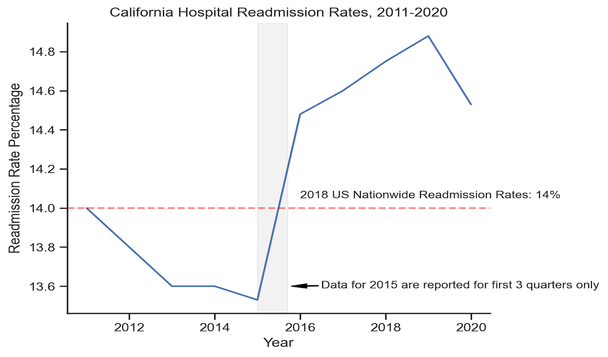
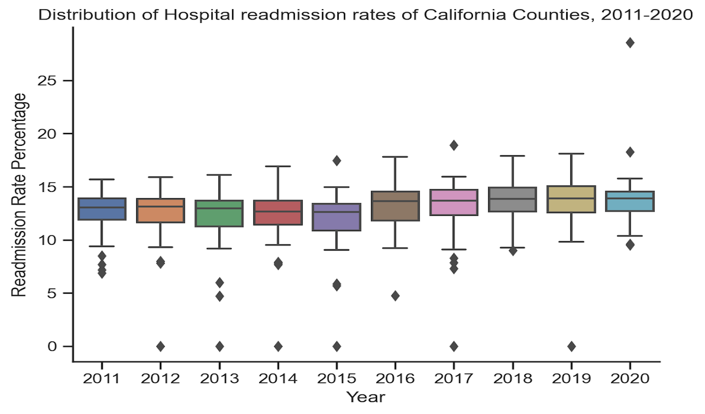

# Analysis of California 30-Day Inpatient Readmission Rates, 2011-2020
## Objective
This is a project to analyze all-cause unplanned 30-day hospital readmission rates of California statewide and counties, for years 2011-2020.

## Hypothesis
Age of patients, race/ethnicity of patients, payer type, county, population to LTC (Long Term Care) type facility ratio, and population to FDR (First Tier, Downstream, and Related Entities defined by CMS) type facility ratio are associated with hospital readmission.

## Language and Tools
- Language: Python
- Libraries: Pandas, Numpy, Matplotlib, Seaborn, Plotly, Requests, Json, Scipy
- Tools: AWS S3, AWS SageMaker

## Step 1 Obtaining the Data
I uploaded below data files to AWS S3 and analyzed them by AWS SageMaker. The data files are from 1 main dataset and 2 subdatasets:

[**California All-Cause Unplanned 30-Day Inpatient Readmission Rates**](https://data.chhs.ca.gov/dataset/all-cause-unplanned-30-day-hospital-readmission-rate-california): It's the main dataset, which contains the statewide number and (unadjusted) rate for all-cause, unplanned, 30-day inpatient readmissions in California hospitals from 2011 to 2020 (contains first three quarters for Year 2015). Data are categorized by age, sex, race/ethnicity, expected payer and county.

[**California Licensed and Certified Healthcare Facility Listing**](https://data.chhs.ca.gov/dataset/healthcare-facility-locations): This dataset was recently updated in December, 2022. It includes California healthcare facilities that are operational and have a current license issued by the California Department of Public Health (CDPH) and/or a current U.S. Department of Health and Human Services’ Centers for Medicare and Medicaid Services (CMS) certification.

[**California County Population 2020-2021**](https://www.census.gov/data/tables/time-series/demo/popest/2020s-counties-detail.html): This dataset includes county population of California in 2020-2021.

## Step 2 Data Cleaning and Manipulation
1) I checked missing values and incorrect data types of all datasets before data cleaning.
2) For the main dataset, I combined ICD-9 and ICD-10 related fields, filled missing values, removed records of unknown counties, unnecessary fields, and outliers.
3) For the licensed facility dataset, I converted uppercase words in the field of county and facility types to be title case.
4) For the population dataset, I deleted unwanted words, replaced unmatched words from the county field, and dropped rows with null population.
5) For all datasets, I removed duplicates, corrected data types, renamed not readable fields,
and then concated them by the shard field `County`.

## Step 3 Analyze

First of all, I checked the trend of hospital readmission rates:

  
&nbsp; &nbsp; 
  

Although readmission rates appear to have increased after 2016, no specific conclusions can be drawn because we are unable to compare ICD-9 (2011-2014) with ICD-10 (October 2015-2020). Overall, readmission rates fluctauted in the range [14.5, 14.9] since 2016.
 
8/9 of the outliers in the boxplot charts are from county [Alpine](https://en.wikipedia.org/wiki/Alpine_County,_California#Geography), whose # of readmissions has range [0, 2]. Alpine is the least populated county in California with only 1,204 people (U.S. Census Bureau, 2020). [91%](https://www.fs.usda.gov/main/stanislaus/about-forest/about-area#:~:text=A%20total%20of%20423%2C520%20acres,Dorado%20and%20Toiyabe%20National%20Forests) of it is located with national forests. According to [Google Maps](https://www.google.com/maps/place/Barton+Memorial+Hospital/@38.7773178,-120.80537,8z/data=!3m1!5s0x80998fb624e853e5:0x3fa23e5fac9ae1ca!4m16!1m9!2m8!1shospital!3m6!1shospital!2sAlpine+County,+CA!3s0x8099e628f40a839b:0xd899bd276743bfa9!4m2!1d-119.8815203!2d38.5940736!3m5!1s0x80998fb623f1a1c1:0x53c4da52ea4e56b8!8m2!3d38.911606!4d-119.9967957!15sCghob3NwaXRhbFoKIghob3NwaXRhbJIBCGhvc3BpdGFsmgEjQ2haRFNVaE5NRzluUzBWSlEwRm5TVVJETm5CTU5tRm5FQUXgAQA), its nearest hospital is even located in El Dorado County, one of its adjacent counties. Given its unique geographical location, the number of admissions and readmissions is extremely low and of unknown origin. I removed its data from this study.

Secondly, I analyzed the readmission rate by Age, Sex, Race-Ethinicity, Payer, and County. Here are the corresponding charts:

  
&nbsp; &nbsp; 
  

  
&nbsp; &nbsp;
  

  
&nbsp; &nbsp;
  

Finally, I calculated the ratio of Population-to-LTC Type Facilities, the ratio of Population-to-FDR Type Facilities, and Pearson's correlation coefficients
between each ratio and readmission rates. Here are the 2 ratios that have positive correlations with readmission rates (correlation coefficient >= 0.25 and a p-value <= 0.05) and the corresponding heatmap:

| Field | Correlation Coefficient | p-value |
|---|:---:|---:|
| General Acute Care Hospital Ratio | 0.438 | 0.000726 |
| Rehabilitation Clinic Ratio | 0.522 | 0.008826 |

  

  

## Step 4 Conclusion and Recommendation
**Conclusion**:
- Age Disparities: Patients age 65 and plus were associated with higher readmission rates.
- Sex Disparities: Male was associated with higher readmission rates.
- Race-Ethnicity Disparities: African Americans, followed by Native Americans, were associated with higher readmission rates.
- Payer Disparities: Patients with Medicare or Medi-Cal coverage were associated with higher readmission rates.
- County Disparities: Butte County had the highest readmission rates in 2011 and 2013-2020.
- Population to Facility Ratio Disparities: The ratio of the population to General Acute Care Hospital and the ratio of the population to Rehabilitation Clinic were positively correlated with readmission rates.

**Recommendation**:
- Further studies are needed to explore the relationships between readmission rates and patient demographics, FDR facilities.
- A case study is needed in Butte County to identify the root causes of its persistently high readmission rates.
